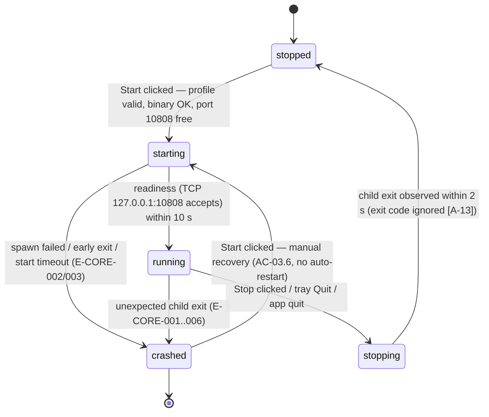
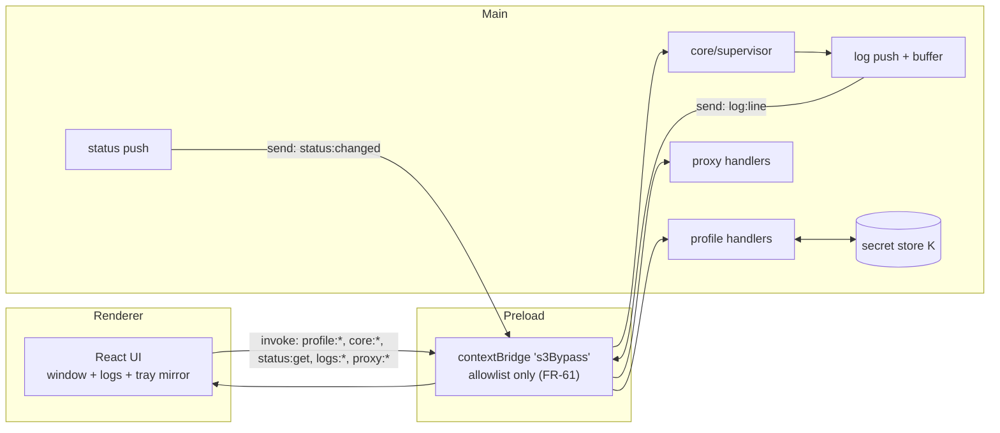

# Data flows — S3 Bypass Desktop (M1 MVP)

Status: **active** · Owner: Business Analyst (task M1-02) · Language: English
Companions: `docs/analysis/requirements.md` (FR/BR IDs), `docs/analysis/errors.md` (E-* codes)
Anchor files: `src/shared/ipc.ts`, `src/shared/constants.ts`, `src/main/index.ts`

Actors/stores used throughout:

| Name                      | Process / location                                  | Holds                                                                |
| ------------------------- | --------------------------------------------------- | -------------------------------------------------------------------- |
| **R** Renderer (React)    | renderer, sandboxed, `contextIsolation: true`       | UI state, `ProfileSummary`, log lines — **never secrets**            |
| **P** Preload             | preload, minimal `contextBridge`                    | allowlisted channel invokers (`src/preload/index.ts`)                |
| **M** Main                | `main` (Node/Electron)                              | supervisor, validator, secret store, proxy control, tray, log buffer |
| **K** Secret store        | app data dir, `safeStorage`-encrypted blob          | full profile document incl. `accessKey`/`secretKey`                  |
| **T** Materialized config | `main`-controlled dir, `0600`, deleted on stop/exit | core config JSON for the child                                       |
| **C** Core child          | `Fedarisha/Xray-core-fedarisha` (M1: stub)          | the tunnel; writes stdout/stderr                                     |
| **OS**                    | `networksetup` (macOS) / `gsettings` (GNOME)        | system proxy settings                                                |

---

## 1. Flow (a) — Profile import: file → parse → validate → encrypt at rest

```text
R: user clicks "Import profile"
   └─ IPC invoke: profile:import-dialog  ──────────────►  M
M: dialog.showOpenDialog() (native picker, owned by M)           [FR-01]
   ├─ user cancels ────────────────────────────────────►  R: { ok:false, reason:"cancelled" }
   │                                                      (NOT an error; prior profile kept) [FR-01]
   └─ path selected
      1. stat(): size > 1 048 576 B ───────────────────►  E-VAL-002        [FR-02, BR-V-02]
      2. read file (utf-8; NUL / decode failure) ──────►  E-VAL-003        [FR-02, BR-V-03]
         (file deleted/permissions lost between picker and read → E-IO-001) [FR-06]
      3. JSON.parse ───────────────────────────────────►  E-VAL-001
         (+ line/column computed from the parse error)   [FR-03]
      4. schema validation (BR-V-01..BR-V-14) ─────────►  E-VAL-004..014
         (single message listing all missing/invalid
          field names, e.g. "missing: S3 endpoint")      [FR-04]
      5. core-running gate: state ∈ {starting,running} ─►  E-VAL-015        [FR-07]
      6. confirm overwrite if a profile exists ─────────►  R: confirm dialog → M  [FR-08]
      7. classify fields (§8.4):
         • SECRET  (accessKey, secretKey, *token*, whole doc)
         • INTERNAL (bucket, endpoint, prefix, region)   [requirements §8.4]
      8. safeStorage.encrypt(fullProfileDoc)             [FR-53]
         ├─ isEncryptionAvailable() === false ──────────►  E-STOR-001 (refuse, no fallback) [FR-53]
         └─ keychain denied/locked ─────────────────────►  E-STOR-002        [FR-57]
      9. write encrypted blob → K (app data dir)         [FR-54 — no plaintext on disk]
     10. build ProfileSummary (non-secret fields only)
              │
              ├─ every step logs through the single redaction entry point
              │  (no file contents, no secrets in the log buffer)  [FR-09, FR-47]
              ▼
R ◄── IPC push/return: ProfileSummary { displayName, endpointHost, bucket,
     prefix, region, importedAt, socksPort }  + status "profile active"  [FR-05]
```

Invariants: R receives step 10 only — never the raw file path contents, never K's blob, never SECRET fields (FR-55). Validation performs **no network calls** (BR-V-16): import works fully offline (NFR-4).

---

## 2. Flow (b) — Core supervision: materialization → spawn → output → exit

### 2.1 Sequence (text)

```text
R: "Start" clicked ── core:start ────────────────────► M
M:
 0. guards: profile exists (else disabled hint, FR-12);
    state == stopped (double-start → reject, FR-18);
    re-validate BR-V-10/V-15 (FR-15)
 1. pre-start checks:
    a. binary exists? no ────────────────────────────► E-IO-004, state stays stopped [FR-14]
       (M2+: SHA-256 vs pin mismatch ────────────────► E-IO-005) [FR-14, NFR-6]
    b. port 10808 free? no ──────────────────────────► E-IO-003 naming the port [FR-15]
 2. state → starting (push status:changed, ≤1 s budget)  [FR-26, NFR-3]
 3. materialize config: decrypt K → merge app-owned inbound
    (listen 127.0.0.1:10808) → write T with 0600;
    path never logged; relative paths resolved from T's dir [FR-22, FR-23]
    write failure ───────────────────────────────────► E-IO-006, state → stopped
 4. spawn(C, [run, -c, T]) as child of M (arg array, no shell)  [PR-08]
    spawn error (ENOENT→E-IO-004 first) ─────────────► E-CORE-003, state → core-crashed
 5. readiness: TCP connect to 127.0.0.1:10808 within 10 s (A-11/A-12)
    ├─ ok ──► state → running (push, ≤1 s)              [FR-13, FR-21]
    └─ timeout ─► kill child, state → core-crashed, E-CORE-002  [FR-20]
 6. streaming: C.stdout/C.stderr line-by-line →
    single redaction entry point (§8.4 classification) →
    bounded buffer (2000 lines, oldest evicted) →
    push log:line to R                               [FR-45..FR-47, FR-52]
 7. exit watcher:
    ├─ exit code 0 while running (unexpected) ───────► state → core-crashed,
    │    lastError = exit code + last redacted line   [FR-17]
    ├─ exit code ≠ 0 ────────────────────────────────► state → core-crashed, E-CORE-001
    │    pattern match on last lines (A-16/Q-AN-07 — PENDING in M1: until it lands,
    │    every non-zero exit reports E-CORE-001, S5-16(c)):
    │      S3 connect refused/timeout ───────────────► E-CORE-004 (NFR-4 distinct msg)
    │      403 / InvalidAccessKeyId / SignatureError ─► E-CORE-005
    │      date/skew signature mismatch ─────────────► E-CORE-006
    └─ requested stop (state == stopping) ───────────► state → stopped (exit code ignored) [A-13]
 8. stop path (user Stop / quit / crash cleanup):
    state → stopping → SIGTERM → (2 s budget) SIGKILL [FR-16]
    → delete T → state → stopped
 9. quit path order (tray Quit / OS session end):
    stop core (8) → revert system proxy (flow c) →
    delete T → app exits; no orphan, no leftover      [FR-19, FR-42]
```

### 2.2 Flowchart

```mermaid
flowchart TD
    A["R: core:start"] --> B{Profile present<br/>and valid?}
    B -- no --> B1["E-VAL-* / disabled hint<br/>state unchanged (FR-12)"]
    B -- yes --> C{State == stopped?}
    C -- no (starting/running) --> C1["Reject duplicate start<br/>(FR-18)"]
    C -- yes --> D{Binary exists<br/>(M2+: SHA-256 matches pin)?}
    D -- no --> D1["E-IO-004 / E-IO-005<br/>state: stopped (FR-14)"]
    D -- yes --> E{Port 10808 free?}
    E -- no --> E1["E-IO-003 names port<br/>state: stopped (FR-15)"]
    E -- yes --> F["state -> starting<br/>push status:changed (FR-26)"]
    F --> G["Materialize config T<br/>0600, path not logged (FR-23)"]
    G -- write fails --> G1["E-IO-006 -> state: stopped"]
    G --> H["spawn core child (arg array)"]
    H -- spawn error --> H1["E-CORE-003 -><br/>state: core-crashed (FR-17)"]
    H --> I{"Readiness: TCP 127.0.0.1:10808<br/>within 10 s (FR-20/21)"}
    I -- ok --> J["state -> running (<=1 s)"]
    I -- timeout --> K["kill child -><br/>state: core-crashed<br/>E-CORE-002"]
    J --> L["stdout/stderr -> redaction<br/>-> 2000-line buffer -> R<br/>(FR-46/47)"]
    L --> M1{"Child exit observed"}
    M1 -- "unexpected (running)" --> N["state -> core-crashed,<br/>lastError = exit code<br/>+ last redacted line (FR-17)"]
    M1 -- "requested (stopping)" --> O["state -> stopped"]
    J --> P["R: core:stop / tray Quit"]
    P --> Q["state -> stopping -><br/>SIGTERM -> 2 s -> SIGKILL (FR-16)"]
    Q --> R1["delete T; on quit: revert proxy<br/>(FR-19, FR-42)"]
    R1 --> O
    N --> S["R: Start clicked again<br/>(manual recovery, AC-03.6)"]
    S --> C
```

### 2.3 Core lifecycle state machine

Internal states: `stopped`, `starting`, `running`, `stopping`, `crashed`
(UI-visible labels per US-03: `stopped` / `running` / `core-crashed`; `starting`/`stopping` render as transient busy text — A-14 / contradiction C-01.)



Transition guards (tested in M1-04):

- Only `stopped → starting` accepts a Start request; `starting`/`running` Start → rejected (single child, AC-02.7).
- Only `running → stopping` accepts Stop; Stop in `stopped`/`crashed` → no-op rejected.
- `crashed → running` is **illegal** (must pass through `starting`).
- Every transition emits one `status:changed` push; `lastError` retained from `crashed`, cleared only on successful `→ running`.

---

## 3. Flow (c) — System-proxy toggle, per platform

Common guard (both platforms): toggle disabled unless state == `running` (FR-30). All OS calls are `execFile` with argument arrays — **no shell string interpolation** (PR-08, M1-20 injection test).

### 3.1 macOS (`networksetup`)

```text
ENABLE (toggle → On):
 1. detect active service: networksetup -listnetworkserviceorder
    └─ several candidates → apply to the active one; ambiguity per Q-B (FR-37)
 2. SNAPSHOT (kept in M only, never logged):
    networksetup -getsocksfirewallproxy <service>
    networksetup -getsecurewebproxy <service>       → prior state (FR-31)
 3. APPLY (arg array):
    networksetup -setsocksfirewallproxy <service> 127.0.0.1 10808
    networksetup -setsocksfirewallproxystate <service> on
 4. non-zero exit at any step → toggle shows Off, E-PLAT-002,
    attempt to restore snapshot (FR-34)
 5. success → toggle "On"; verify via -getsocksfirewallproxy (AC-04.1)

DISABLE / STOP / CRASH / QUIT (toggle was On):
 1. restore SNAPSHOT values byte-for-byte (AC-04.3)
 2. restore fails → E-PLAT-003 persistent warning with the exact manual
    values (127.0.0.1, 10808) — never silent leftover (FR-35, fail closed)
```

### 3.2 Linux — GNOME (`gsettings`)

```text
SUPPORT DETECT: $XDG_CURRENT_DESKTOP mentions GNOME AND
  gsettings get org.gnome.system.proxy.socks succeeds (schema present)
  └─ otherwise → replace toggle with E-PLAT-001 manual hint
     listing 127.0.0.1 and 10808 (FR-33, AC-04.5)

ENABLE:
 1. SNAPSHOT: gsettings get org.gnome.system.proxy mode
              gsettings get org.gnome.system.proxy.socks host
              gsettings get org.gnome.system.proxy.socks port
 2. APPLY (arg array):
    gsettings set org.gnome.system.proxy.socks host '127.0.0.1'
    gsettings set org.gnome.system.proxy.socks port 10808
    gsettings set org.gnome.system.proxy mode 'manual'
 3. non-zero exit → Off + E-PLAT-002 (FR-34)
 4. verify: gsettings reports SOCKS 127.0.0.1:10808 (AC-04.2)

DISABLE / STOP / CRASH / QUIT:
 1. restore snapshot triples (mode, host, port) (AC-04.3)
 2. failure → E-PLAT-003 persistent warning (FR-35)
```

### 3.3 Unsupported desktop (both flows' fallback)

```text
No networksetup (non-macOS) or no GNOME schema → no toggle at all;
show hint: "Not supported on this desktop — set it manually:
SOCKS proxy 127.0.0.1, port 10808."  [E-PLAT-001, FR-33]
```

Consistency rule (US-04 edge, FR-36): after suspend/resume, if core ≠ `running` while toggle = On → auto-revert or raise `E-PLAT-003`; status and toggle never disagree on screen.

---

## 4. Flow (d) — IPC surface (renderer ↔ preload ↔ main)

Boundary rules: `contextIsolation: true`, `nodeIntegration: false` (already set in `src/main/index.ts:11-14`); the renderer reaches `main` **only** through the preload allowlist (FR-61); payload types live in `src/shared/ipc.ts` (FR-62); denylist: no channel may return `accessKey`, `secretKey`, any `*token*`, or the full config JSON (FR-64).

### 4.1 Diagram



### 4.2 Channel table — the M1 contract

Status: `EXISTS` = present in code today; `PROPOSED` = defined here per M1-02 but not yet implemented — **no `PROPOSED` rows remain**: every channel below landed (M1-07/M1-12/M1-17/M1-19/M1-21; `proxy:*` with M1-27b) and was flipped here as one spec amendment (D-09, M1-27b).

| Channel                                      | Direction | Kind             | Payload in                 | Payload out                                                                                                                                                                                   | FR                                                                                                              | Status                                                             |
| -------------------------------------------- | --------- | ---------------- | -------------------------- | --------------------------------------------------------------------------------------------------------------------------------------------------------------------------------------------- | --------------------------------------------------------------------------------------------------------------- | ------------------------------------------------------------------ |
| `app:ping`                                   | R → M     | invoke           | `void`                     | `PingResult { ok, app, socksPort }`                                                                                                                                                           | —                                                                                                               | **EXISTS** (`src/shared/constants.ts:3`, `src/shared/ipc.ts:1-5`)  |
| `app:versions` (static field, not a channel) | —         | preload constant | —                          | `AppVersions { electron, chrome, node }`                                                                                                                                                      | —                                                                                                               | **EXISTS** (`src/shared/ipc.ts:7-11`, `src/preload/index.ts:8-12`) |
| `profile:import-dialog`                      | R → M     | invoke           | `void` (picker opens in M) | `{ ok: true, summary: ProfileSummary }` \| `{ ok: false, reason: "cancelled" }` \| `{ ok: false, reason: "declined" }` \| `{ ok: false, reason: "busy" }` \| `{ ok: false, error: AppError }` | FR-01, FR-05, FR-08; S4-6 (`busy` = M1-26b/issue #5; `declined` = M1-13, missing here until now → S5-16 bundle) | **EXISTS** (`src/main/index.ts`)                                   |
| `profile:get`                                | R → M     | invoke           | `void`                     | `{ summary: ProfileSummary \| null }` — **never the full config**                                                                                                                             | FR-05, FR-55                                                                                                    | **EXISTS** (`src/main/index.ts`)                                   |
| `profile:remove`                             | R → M     | invoke           | `void`                     | `{ ok: boolean, error?: AppError }`                                                                                                                                                           | FR-60                                                                                                           | **EXISTS** (`src/main/index.ts`)                                   |
| `core:start`                                 | R → M     | invoke           | `void`                     | `{ ok: true }` \| `{ ok: false, error: AppError }`                                                                                                                                            | FR-13..FR-15                                                                                                    | **EXISTS** (`src/main/index.ts`)                                   |
| `core:stop`                                  | R → M     | invoke           | `void`                     | `{ ok: true }` \| `{ ok: false, error: AppError }`                                                                                                                                            | FR-16                                                                                                           | **EXISTS** (`src/main/index.ts`)                                   |
| `status:get`                                 | R → M     | invoke           | `void`                     | `StatusSnapshot { state: "stopped"\|"starting"\|"running"\|"stopping"\|"crashed", lastError: AppError \| null, socksPort: number }`                                                           | FR-25, FR-27                                                                                                    | **EXISTS** (`src/main/index.ts`)                                   |
| `status:changed`                             | M → R     | send (push)      | —                          | `StatusSnapshot`                                                                                                                                                                              | FR-26, FR-63                                                                                                    | **EXISTS** (`src/main/index.ts`)                                   |
| `logs:get`                                   | R → M     | invoke           | `void`                     | `{ lines: LogLine[] }` (redacted, ≤2000)                                                                                                                                                      | FR-45                                                                                                           | **EXISTS** (`src/main/index.ts`)                                   |
| `log:line`                                   | M → R     | send (push)      | —                          | `LogLine { ts: string, level: "debug"\|"info"\|"warn"\|"error", source: "core"\|"app", text: string /* redacted */ }`                                                                         | FR-47, FR-63                                                                                                    | **EXISTS** (`src/main/index.ts`)                                   |
| `logs:clear`                                 | R → M     | invoke           | `void`                     | `{ ok: true }`                                                                                                                                                                                | FR-46 (view clear)                                                                                              | **EXISTS** (`src/main/index.ts`)                                   |
| `proxy:get`                                  | R → M     | invoke           | `void`                     | `{ supported: boolean, active: boolean, hint?: { host: "127.0.0.1", port: 10808 } }`                                                                                                          | FR-33, FR-37                                                                                                    | **EXISTS** (`src/main/index.ts`)                                   |
| `proxy:set`                                  | R → M     | invoke           | `{ enabled: boolean }`     | `{ ok: true }` \| `{ ok: false, error: AppError }`                                                                                                                                            | FR-31..FR-35                                                                                                    | **EXISTS** (`src/main/index.ts`)                                   |

Shared payload types (`src/shared/ipc.ts`): `ProfileSummary` (requirements §8.3), `StatusSnapshot`, `LogLine`, `AppError { code: string /* E-CLASS-NNN */, title: string, cause: string, nextStep: string }` — the NFR-5 triple travels as data so the renderer renders it uniformly and copyably.

Not IPC (main-internal, listed for completeness): tray menu actions (Open / Start / Stop / Quit) are `main` event handlers that reuse the same supervisor/proxy functions as `core:*` / `proxy:*`; window show/hide is `main`-internal; secret-store functions are **never** bridged (FR-55).

### 4.3 Explicit denylist (must never cross main → renderer)

`accessKey` · `secretKey` · any field matching `*token*` (case-insensitive) · full profile/config JSON (raw file text) · the materialized config path `T` · keychain blob contents.
Test hook: M1-06 channel tests invoke every allowlisted channel and assert the serialized payloads match none of the denylist values (FR-64).

---

## 5. Cross-flow notes

- **Quit ordering** (applies to tray Quit and OS session end): stop core (flow b step 9) → revert proxy (flow c) → delete `T` → exit. Any failure in revert is swallowed by the teardown (the exit must not block); quit-time surfacing (pre-exit dialog / persisted `lastError`) is **not implemented in M1** — known gap S5-16(d), revisit with E-PLAT-003 surfacing (M2). Non-quit proxy failures DO surface today through the `proxy:set` triple and the auto-apply dialog (M1-27b).
- **Startup path** (NFR-3/NFR-4): launch → create window/tray → `profile:get` → `status:get` → render. Zero network calls; zero decryption failures crash the app (decrypt failure → `E-STOR-003` state "no profile").
- **Single log entry point**: flows (a), (b), (c) all emit through the log collector (`src/main/log-collector.ts`, `createLogCollector`) that applies §8.4 redaction before anything reaches the buffer, `log:line`, or `lastError` (FR-47, NFR-2).
