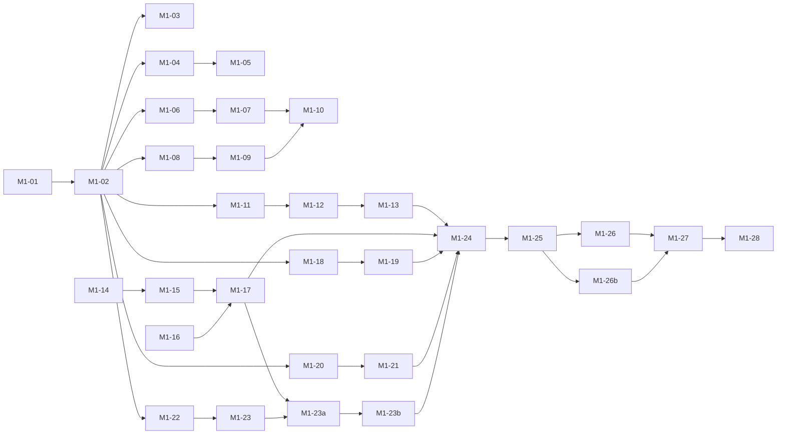

# M1 — MVP core loop: task breakdown

Milestone: **M1** (BRIEF §2) · Owner: Project Manager · Status: **in progress** (M1-01..M1-27 delivered; M1-27 acceptance **NO-GO** → M1-27b in progress — remediation issues #14..#18, owner Q1/Q2/Q9 in acceptance §8; M1-28 flips this milestone. Local E2E needs port `127.0.0.1:10808` free — Q9 waiver in place)
Parent plan: `docs/plans/milestones.md`

**Legend:** task ID · owner · size (S ≈ 0.5 d, M ≈ 0.5–1.5 d, L ≈ 2+ d) · deps · status
**Status values:** `todo` / `in progress` / `done` / `blocked`
**Estimate range:** 3–5 weeks total (assumptions in `milestones.md` §Estimates).

**Strict TDD rule for this plan:** every feature is built as a **RED → GREEN pair**.
The QA task (failing tests first) must be merged/visible before the developer task
starts; tests are never weakened to pass. Rows below are ordered so each task's
dependencies are satisfied before it opens.

**Gate:** no M1 task opens until M0 DoD is met
(`docs/plans/m0-scaffold.md` M0-20 done — toolchain, CI, docs skeleton in place).

---

## Phase A — Spec & analysis (delivery flow: spec → analysis)

- [x] **M1-01** · product-manager · **M** · deps: — · `done`
      User stories in `docs/product/` for all 7 BRIEF §2 items, each with
      acceptance criteria (profile import, start/stop, status, system proxy,
      tray, logs, secret storage). Includes the "no raw stack traces" and
      "never secrets in logs/renderer" rules as explicit ACs.
- [x] **M1-02** · business-analyst · **M** · deps: M1-01 · `done`
      `docs/analysis/`: requirements, business rules, data flows, and the
      **IPC contract** (channel allowlist, what crosses main↔renderer, what must
      _never_ cross it — secrets stay in `main`). S3 config field list defined here.
- [x] **M1-03** · qa · **S** · deps: M1-02 · `done`
      Test strategy for M1 in `docs/qa/`: unit (Vitest), integration (supervisor
      with stub binary), smoke E2E (Playwright, later in M1-24). Coverage targets
      for status machine, redaction, validator.

## Phase B — Foundation: state machine & IPC surface

- [x] **M1-04** · qa · **S** · deps: M1-02 · `done`
      **RED:** unit tests for core status machine in `src/shared/`:
      `stopped → starting → running → stopped`, `starting/running → core-crashed`,
      last-error retention, invalid transitions rejected.
- [x] **M1-05** · developer · **S** · deps: M1-04 · `done`
      **GREEN:** implement status machine + shared types (`src/shared/`).
- [x] **M1-06** · qa · **S** · deps: M1-02 · `done`
      **RED:** IPC contract tests — only allowlisted channels reachable from
      renderer; attempting a secret-bearing channel from renderer fails.
- [x] **M1-07** · developer · **M** · deps: M1-06 · `done`
      **GREEN:** preload `contextBridge` surface + `ipcMain` handlers per
      `docs/analysis/` contract; status-change push events to renderer.

## Phase C — Secret storage (BRIEF §2.7)

- [x] **M1-08** · qa · **S** · deps: M1-02 · `done`
      **RED:** tests for at-rest encryption via `safeStorage`: encrypt→decrypt
      round-trip; written file contains no plaintext key material; decrypt failure
      surfaces a readable error, not a crash.
- [x] **M1-09** · developer · **M** · deps: M1-08 · `done`
      **GREEN:** secret-store module in `main` (profile JSON + S3 keys encrypted
      at rest); API only callable from `main` — never exposed on IPC.
- [x] **M1-10** · cybersecurity · **S** · deps: M1-07, M1-09 · `done`
      Review #1: IPC surface + secret storage (read-only). Findings → issues;
      `critical/high` block the dependent tasks from `done`.

## Phase D — Profile import (BRIEF §2.1)

- [x] **M1-11** · qa · **M** · deps: M1-02 · `done`
      **RED:** validator tests — valid client-config JSON accepted; malformed JSON,
      wrong schema, missing S3 fields each produce a specific, human-readable
      error message (assert message text; assert **no** stack traces).
- [x] **M1-12** · developer · **M** · deps: M1-11, M1-07 · `done`
      **GREEN:** file picker (dialog in `main`), validation pipeline, import UI
      with clear error display.
- [x] **M1-13** · developer · **S** · deps: M1-12, M1-09 · `done`
      Persist imported profile through the secret store; re-import overwrites
      with confirmation.

## Phase E — Supervisor: start/stop + status (BRIEF §2.2, §2.3)

- [x] **M1-14** · qa · **M** · deps: M1-02, M1-03 · `done`
      **RED:** supervisor integration tests against a **stub core binary**
      (fixture script): spawn → `running`; stop → clean kill + `stopped`;
      nonzero exit → `core-crashed` with last error captured; port arg
      `127.0.0.1:10808` passed. _(Stub needed because binary pinning is M2 — risk R-1.)_
- [x] **M1-15** · developer · **L** · deps: M1-14, M1-12 · `done`
      **GREEN:** child-process supervisor in `main` (spawn, kill, crash detection,
      exit-code capture, shutdown on app quit); config generated for the core from
      the stored profile; local SOCKS inbound `127.0.0.1:10808`.
- [x] **M1-16** · qa · **S** · deps: M1-14 · `done`
      **RED:** status exposure tests — renderer receives `running/stopped/
core-crashed` transitions and the last error string.
- [x] **M1-17** · developer · **M** · deps: M1-15, M1-16, M1-07 · `done`
      **GREEN:** status wiring end-to-end (supervisor → IPC → UI), Start/Stop
      button behavior incl. disabled/busy states.
      _(Includes tray mirror `buildTrayMenu`/`setToolTip`; window close-to-tray
      and quit-teardown wiring deferred → M1-23a/b follow-up rows.)_

## Phase F — Logs view (BRIEF §2.6)

- [x] **M1-18** · qa · **M** · deps: M1-02 · `done`
      **RED:** tests for bounded in-memory buffer (cap enforced, oldest evicted);
      **redaction** — lines containing S3 keys/credentials/config blobs are
      redacted or dropped; no unbounded growth under 10k lines.
- [x] **M1-19** · developer · **M** · deps: M1-18, M1-15 · `done`
      **GREEN:** log collector in `main` (core stdout/stderr + app events),
      renderer logs view (scroll, clear, copy), redaction pipeline.
      _(Supervisor `logSink` → collector wiring lands with M1-15; collector
      accepts the pinned `{stream, text}` contract as-is.)_

## Phase G — System-proxy toggle (BRIEF §2.4)

- [x] **M1-20** · qa · **S** · deps: M1-02 · `done`
      **RED:** unit tests for command construction + platform branching:
      macOS `networksetup` args, Linux GNOME `gsettings` args, unsupported
      desktop → returns the honest "do it manually" hint (assert exact wording
      source), no shell injection from config values.
- [x] **M1-21** · developer · **M** · deps: M1-20, M1-15 · `done`
      **GREEN:** system-proxy module (exec, no shell interpolation), toggle UI
      with manual-hint fallback; proxy set on start, restored on stop/crash/quit.
      _(Module only; start/stop integration hooks land in M1-23b.)_

## Phase H — Tray & window lifecycle (BRIEF §2.5)

- [x] **M1-22** · qa · **S** · deps: M1-02 · `done`
      **RED:** tests for window lifecycle policy: app starts hidden to tray;
      closing window keeps process alive; explicit Quit exits and stops core.
- [x] **M1-23** · developer · **M** · deps: M1-22, M1-07 · `done`
      **GREEN:** tray icon + menu (Open / Start / Stop / Quit), close-to-tray
      behavior, quit path stops supervisor and restores system proxy.
      _(Policy module `window-lifecycle.ts` + tray menu model done; native
      wiring → M1-23a/b.)_
- [x] **M1-23a** · qa · **S** · deps: M1-17, M1-23 · `done`
      **RED:** `index.ts` native wiring pins — `app.on('close')` routes through
      `handleCloseRequest` (hide-to-tray), `before-quit` runs
      `handleBeforeQuit` teardown (stopCore → restoreProxy → requestQuit),
      `window-all-closed` keeps the process alive while the tray exists, and
      the system-proxy restore hook is wired (structural + mocked-electron
      tests; module-level ACs already covered by M1-22).
- [x] **M1-23b** · developer · **S** · deps: M1-23a · `done`
      **GREEN:** wire `createWindowLifecycle` + `restoreSystemProxy` +
      `stopCore→coreWiring.handleStop` into `index.ts` quit/close paths;
      `setSystemProxy` on Start (behind the existing AC/scope of US-04 as
      pinned by M1-23a).
      _(`setSystemProxy`-on-Start NOT implemented — DV-30(4): auto vs manual
      is a spec-owner decision (Q owner); `proxy:set` placeholder untouched.)_

## Phase I — Integration, security, acceptance

- [x] **M1-24** · qa · **M** · deps: M1-13, M1-17, M1-19, M1-21, M1-23b · `done`
      Smoke E2E (Playwright, Electron): import fixture profile → Start → status
      `running` → Logs visible → Stop → status `stopped`.
      _(TC-E2E-01: 3 consecutive greens + 1 preflight-failure run (DV-31, m1-test-plan §13); `npm run test:e2e`; CI integration deferred
      per strategy §2 L3 — proposal in `docs/qa/e2e-ci-proposal.md`.)_
- [x] **M1-25** · cybersecurity · **M** · deps: M1-24 · `done`
      Full MVP security review: S3 key handling, IPC surface, log redaction,
      supply chain (BRIEF §5). Gate for external distribution (M2 exit).
      _(Verdict **PASS-with-blockers**: 0 critical, 1 high (S5-1), 6 medium
      (S5-2..7) → issues #7–#13, deadlines M1-26; report
      `docs/qa/security-m1-25.md`; issue #1 not regressed, #6 closed.)_
- [x] **M1-26** · developer · **S** · deps: M1-25 · `done`
      Remediate security findings; regression tests added for each fix (RED first).
      _(S5-1..S5-7 = issues #7–#13 fixed; RED `085b7dc` → GREEN `bee1e08`;
      209/0 after DV-33 cross-file port mutex `e5720e3`; D3 supervisor
      TOCTOU-grace/re-spawn addition flagged for security review in M1-26b.)_
- [x] **M1-26b** · developer · **S** · deps: M1-25, M1-26 · `done`
      Stale M1-10 follow-ups before the M1-28 gate: issues #3 (exact-path
      navigation), #4 (secret-store hardening — deadline M1-12 **missed**),
      #5 (broadcast targeting/payload validation/throttling — features now
      landed). Verify each against current code; RED first where still open;
      close with evidence where already covered. **+ security review of dev
      deviation D3** (supervisor TOCTOU port grace ≤3 s + bounded EADDRINUSE
      re-spawn, M1-26 GREEN) — sign off or file a follow-up.
      _(Verification report `docs/qa/security-m1-26b.md`: #3 OPEN, #4 OPEN
      (deadline miss recorded), #5 PARTIAL (S4-3 covered → evidence on the
      issue; S4-4 blocked on owner DV-30(4); S4-6 open), **D3 signed off
      as-is** with two advisories folded into S5-16. RED `a1e5523` → GREEN
      `a4a0b69`: TC-IPC-14 + TC-07-20/21/22 + TC-01-42 (DV-34, 169 → 174 TCs);
      local 199/199 non-port files (the 18 port cases ride CI);
      issues #3/#4 closed with evidence; #7–#13 (S5-1..S5-7) closed with
      `085b7dc`/`bee1e08` evidence; #5 stays open on S4-4.)_
- [x] **M1-27** · product-manager · **S** · deps: M1-26, M1-26b · `done`
      Acceptance pass against BRIEF §2 on macOS **and** Linux; sign off or file
      defects.
      _(Report `docs/qa/acceptance-m1-27.md`: **NO-GO** — §2.4 toggle not
      wired end-to-end (D-01 high, confirmed in code: `App.tsx` keeps local
      state, `proxy:set` still E-PLAT-001) and §2.5 launch-hidden never wired
      (D-02); blockers B-01..B-04 = D-01 (owner Q1+Q2 → wiring, or amendment),
      D-02 (wiring or §2.5 amendment), B-03 DoD #1 manual script + B-04 stale
      E2E (VPN-off window or written owner waiver). Everything else PASS:
      48/48 story ACs mapped, RED→GREEN chain verified, CI both-OS legs green
      on `3a74994`, security gates met, counts reconcile (174 = 141+9+12+12).
      Defects D-01..D-11 filed as GitHub issues from §4; evidence gaps
      G-01..G-06 + owner questions Q1/Q2/Q9 in §5/§7.)_
- [ ] **M1-27b** · developer · **M** · deps: M1-27 · `todo`
      Remediate the M1-27 NO-GO (issues filed from `acceptance-m1-27.md` §4;
      **owner Q1/Q2 answered + Q9 waived — report §8, US-04 amended
      2026-10-08**):
      **D-01** proxy toggle wiring — fully unblocked: auto-on-start semantics + SOCKS-only per amended AC-04.1/04.6/04.7; main half (`proxy:set`
      real handler incl. S4-4 validation + auto-apply call site after tunnel
      Start) lands with #5, renderer half (`onChange → setProxy`, initial
      `getProxy`, honest state mirror + E-PLAT surfacing); **D-02** `show:false` + `shouldShowWindowOnLaunch()` in `createWindow` (or owner amendment to
      §2.5); **D-03** pass `desktopEnv` into `systemProxyContext` (S5-10);
      **D-04..D-10** docs-drift bundle (incl. the stale S5-16 list, deadline
      M1-27 missed); **D-11** coverage thresholds + CI coverage job (or
      documented M2 deferral). RED→GREEN per pair, tests additive only.
      Evidence items **B-03/B-04**: CLEARED by written owner waiver
      (acceptance §8 Q9 — CI both-OS + 199/199 + E2E M1-24 as basis; desktop
      manual rows → M2 fresh-machine DoD).
- [ ] **M1-28** · project-manager · **S** · deps: M1-27 + M1-27b blockers cleared + CI green · `todo`
      Flip M1 to `done` in `milestones.md`; announce handoff → devops (M2).
      (M1-27 verdict is **NO-GO** — M1-28 may not flip until **B-01/B-02**
      close via M1-27b; B-03/B-04 already waived in writing, acceptance §8.)

---

## Dependency graph (within M1)

## Handoffs (explicit, in order)

1. `product-manager` (M1-01) → `business-analyst` (M1-02) → `qa` (M1-03):
   stories before rules, rules before tests.
2. `qa` RED task → `developer` GREEN task for every pair (M1-04→05, 06→07, 08→09,
   11→12, 14→15, 16→17, 18→19, 20→21, 22→23): written failing tests are the contract.
3. `cybersecurity` review M1-10 gates `done` for M1-09/M1-07; M1-25 gates M1-26 → M1-27.
4. `project-manager` (M1-28) → `devops`: M1 done opens M2 packaging.

## Sizing summary

| Phase           | Tasks     | Sizes         | Range     |
| --------------- | --------- | ------------- | --------- |
| A Spec/analysis | M1-01..03 | S, M, M       | 2–4 d     |
| B Foundation    | M1-04..07 | S, S, S, M    | 2–3 d     |
| C Secrets       | M1-08..10 | S, M, S       | 1.5–3 d   |
| D Import        | M1-11..13 | M, M, S       | 2–4 d     |
| E Supervisor    | M1-14..17 | M, L, S, M    | 4–7 d     |
| F Logs          | M1-18..19 | M, M          | 1.5–3 d   |
| G System proxy  | M1-20..21 | S, M          | 1.5–2.5 d |
| H Tray          | M1-22..23 | S, M          | 1.5–2.5 d |
| I Integration   | M1-24..28 | M, M, S, S, S | 3–5 d     |

## Risks specific to M1

| ID  | Risk                                                                         | Mitigation                                                                   |
| --- | ---------------------------------------------------------------------------- | ---------------------------------------------------------------------------- |
| R-1 | No pinned core binary until M2 → supervisor tests have nothing real to spawn | Stub fixture binary (M1-14); real-binary integration re-tested in M2         |
| R-3 | Spec/analysis docs don't exist yet                                           | Phase A is mandatory gate; M1-04+ blocked until M1-02 `done`                 |
| R-5 | `safeStorage` unavailable on some Linux keyring setups                       | M1-08 includes an explicit failure-path test; UI must show actionable error  |
| R-6 | Linux proxy support beyond GNOME unknown                                     | Per BRIEF: non-GNOME → honest manual hint (M1-20 asserts it); no scope creep |
| R-7 | Playwright-Electron E2E flakiness                                            | Smoke kept to one happy path; unit/integration carry the load                |
