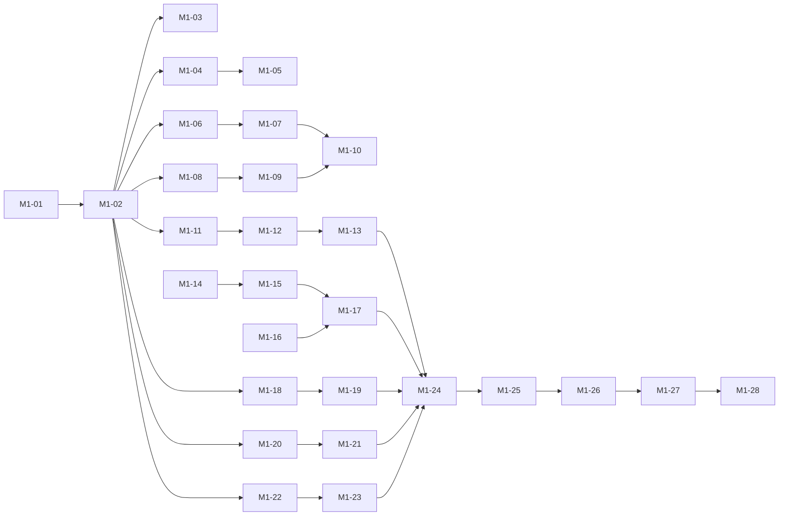

# M1 — MVP core loop: task breakdown

Milestone: **M1** (BRIEF §2) · Owner: Project Manager · Status: **PHASE A DONE** (M1-01..M1-03 delivered; Phase B opens when M0-20 flips M0)
Parent plan: `docs/plans/milestones.md`

**Legend:** task ID · owner · size (S ≈ 0.5 d, M ≈ 0.5–1.5 d, L ≈ 2+ d) · deps · status
**Status values:** `todo` / `in progress` / `done` / `blocked`
**Estimate range:** 3–5 weeks total (assumptions in `milestones.md` §Estimates).

**Strict TDD rule for this plan:** every feature is built as a **RED → GREEN pair**.
The QA task (failing tests first) must be merged/visible before the developer task
starts; tests are never weakened to pass. Rows below are ordered so each task's
dependencies are satisfied before it opens.

**Gate:** no M1 task opens until M0 DoD is met
(`docs/plans/m0-scaffold.md` M0-20 done — toolchain, CI, docs skeleton in place).

---

## Phase A — Spec & analysis (delivery flow: spec → analysis)

- [x] **M1-01** · product-manager · **M** · deps: — · `done`
      User stories in `docs/product/` for all 7 BRIEF §2 items, each with
      acceptance criteria (profile import, start/stop, status, system proxy,
      tray, logs, secret storage). Includes the "no raw stack traces" and
      "never secrets in logs/renderer" rules as explicit ACs.
- [x] **M1-02** · business-analyst · **M** · deps: M1-01 · `done`
      `docs/analysis/`: requirements, business rules, data flows, and the
      **IPC contract** (channel allowlist, what crosses main↔renderer, what must
      _never_ cross it — secrets stay in `main`). S3 config field list defined here.
- [x] **M1-03** · qa · **S** · deps: M1-02 · `done`
      Test strategy for M1 in `docs/qa/`: unit (Vitest), integration (supervisor
      with stub binary), smoke E2E (Playwright, later in M1-24). Coverage targets
      for status machine, redaction, validator.

## Phase B — Foundation: state machine & IPC surface

- [ ] **M1-04** · qa · **S** · deps: M1-02 · `todo`
      **RED:** unit tests for core status machine in `src/shared/`:
      `stopped → starting → running → stopped`, `starting/running → core-crashed`,
      last-error retention, invalid transitions rejected.
- [ ] **M1-05** · developer · **S** · deps: M1-04 · `todo`
      **GREEN:** implement status machine + shared types (`src/shared/`).
- [ ] **M1-06** · qa · **S** · deps: M1-02 · `todo`
      **RED:** IPC contract tests — only allowlisted channels reachable from
      renderer; attempting a secret-bearing channel from renderer fails.
- [ ] **M1-07** · developer · **M** · deps: M1-06 · `todo`
      **GREEN:** preload `contextBridge` surface + `ipcMain` handlers per
      `docs/analysis/` contract; status-change push events to renderer.

## Phase C — Secret storage (BRIEF §2.7)

- [ ] **M1-08** · qa · **S** · deps: M1-02 · `todo`
      **RED:** tests for at-rest encryption via `safeStorage`: encrypt→decrypt
      round-trip; written file contains no plaintext key material; decrypt failure
      surfaces a readable error, not a crash.
- [ ] **M1-09** · developer · **M** · deps: M1-08 · `todo`
      **GREEN:** secret-store module in `main` (profile JSON + S3 keys encrypted
      at rest); API only callable from `main` — never exposed on IPC.
- [ ] **M1-10** · cybersecurity · **S** · deps: M1-07, M1-09 · `todo`
      Review #1: IPC surface + secret storage (read-only). Findings → issues;
      `critical/high` block the dependent tasks from `done`.

## Phase D — Profile import (BRIEF §2.1)

- [ ] **M1-11** · qa · **M** · deps: M1-02 · `todo`
      **RED:** validator tests — valid client-config JSON accepted; malformed JSON,
      wrong schema, missing S3 fields each produce a specific, human-readable
      error message (assert message text; assert **no** stack traces).
- [ ] **M1-12** · developer · **M** · deps: M1-11, M1-07 · `todo`
      **GREEN:** file picker (dialog in `main`), validation pipeline, import UI
      with clear error display.
- [ ] **M1-13** · developer · **S** · deps: M1-12, M1-09 · `todo`
      Persist imported profile through the secret store; re-import overwrites
      with confirmation.

## Phase E — Supervisor: start/stop + status (BRIEF §2.2, §2.3)

- [ ] **M1-14** · qa · **M** · deps: M1-02, M1-03 · `todo`
      **RED:** supervisor integration tests against a **stub core binary**
      (fixture script): spawn → `running`; stop → clean kill + `stopped`;
      nonzero exit → `core-crashed` with last error captured; port arg
      `127.0.0.1:10808` passed. _(Stub needed because binary pinning is M2 — risk R-1.)_
- [ ] **M1-15** · developer · **L** · deps: M1-14, M1-12 · `todo`
      **GREEN:** child-process supervisor in `main` (spawn, kill, crash detection,
      exit-code capture, shutdown on app quit); config generated for the core from
      the stored profile; local SOCKS inbound `127.0.0.1:10808`.
- [ ] **M1-16** · qa · **S** · deps: M1-14 · `todo`
      **RED:** status exposure tests — renderer receives `running/stopped/
core-crashed` transitions and the last error string.
- [ ] **M1-17** · developer · **M** · deps: M1-15, M1-16, M1-07 · `todo`
      **GREEN:** status wiring end-to-end (supervisor → IPC → UI), Start/Stop
      button behavior incl. disabled/busy states.

## Phase F — Logs view (BRIEF §2.6)

- [ ] **M1-18** · qa · **M** · deps: M1-02 · `todo`
      **RED:** tests for bounded in-memory buffer (cap enforced, oldest evicted);
      **redaction** — lines containing S3 keys/credentials/config blobs are
      redacted or dropped; no unbounded growth under 10k lines.
- [ ] **M1-19** · developer · **M** · deps: M1-18, M1-15 · `todo`
      **GREEN:** log collector in `main` (core stdout/stderr + app events),
      renderer logs view (scroll, clear, copy), redaction pipeline.

## Phase G — System-proxy toggle (BRIEF §2.4)

- [ ] **M1-20** · qa · **S** · deps: M1-02 · `todo`
      **RED:** unit tests for command construction + platform branching:
      macOS `networksetup` args, Linux GNOME `gsettings` args, unsupported
      desktop → returns the honest "do it manually" hint (assert exact wording
      source), no shell injection from config values.
- [ ] **M1-21** · developer · **M** · deps: M1-20, M1-15 · `todo`
      **GREEN:** system-proxy module (exec, no shell interpolation), toggle UI
      with manual-hint fallback; proxy set on start, restored on stop/crash/quit.

## Phase H — Tray & window lifecycle (BRIEF §2.5)

- [ ] **M1-22** · qa · **S** · deps: M1-02 · `todo`
      **RED:** tests for window lifecycle policy: app starts hidden to tray;
      closing window keeps process alive; explicit Quit exits and stops core.
- [ ] **M1-23** · developer · **M** · deps: M1-22, M1-07 · `todo`
      **GREEN:** tray icon + menu (Open / Start / Stop / Quit), close-to-tray
      behavior, quit path stops supervisor and restores system proxy.

## Phase I — Integration, security, acceptance

- [ ] **M1-24** · qa · **M** · deps: M1-13, M1-17, M1-19, M1-21, M1-23 · `todo`
      Smoke E2E (Playwright, Electron): import fixture profile → Start → status
      `running` → Logs visible → Stop → status `stopped`.
- [ ] **M1-25** · cybersecurity · **M** · deps: M1-24 · `todo`
      Full MVP security review: S3 key handling, IPC surface, log redaction,
      supply chain (BRIEF §5). Gate for external distribution (M2 exit).
- [ ] **M1-26** · developer · **S** · deps: M1-25 · `todo`
      Remediate security findings; regression tests added for each fix (RED first).
- [ ] **M1-27** · product-manager · **S** · deps: M1-26 · `todo`
      Acceptance pass against BRIEF §2 on macOS **and** Linux; sign off or file
      defects.
- [ ] **M1-28** · project-manager · **S** · deps: M1-27 + CI green · `todo`
      Flip M1 to `done` in `milestones.md`; announce handoff → devops (M2).

---

## Dependency graph (within M1)

## Handoffs (explicit, in order)

1. `product-manager` (M1-01) → `business-analyst` (M1-02) → `qa` (M1-03):
   stories before rules, rules before tests.
2. `qa` RED task → `developer` GREEN task for every pair (M1-04→05, 06→07, 08→09,
   11→12, 14→15, 16→17, 18→19, 20→21, 22→23): written failing tests are the contract.
3. `cybersecurity` review M1-10 gates `done` for M1-09/M1-07; M1-25 gates M1-26 → M1-27.
4. `project-manager` (M1-28) → `devops`: M1 done opens M2 packaging.

## Sizing summary

| Phase           | Tasks     | Sizes         | Range     |
| --------------- | --------- | ------------- | --------- |
| A Spec/analysis | M1-01..03 | S, M, M       | 2–4 d     |
| B Foundation    | M1-04..07 | S, S, S, M    | 2–3 d     |
| C Secrets       | M1-08..10 | S, M, S       | 1.5–3 d   |
| D Import        | M1-11..13 | M, M, S       | 2–4 d     |
| E Supervisor    | M1-14..17 | M, L, S, M    | 4–7 d     |
| F Logs          | M1-18..19 | M, M          | 1.5–3 d   |
| G System proxy  | M1-20..21 | S, M          | 1.5–2.5 d |
| H Tray          | M1-22..23 | S, M          | 1.5–2.5 d |
| I Integration   | M1-24..28 | M, M, S, S, S | 3–5 d     |

## Risks specific to M1

| ID  | Risk                                                                         | Mitigation                                                                   |
| --- | ---------------------------------------------------------------------------- | ---------------------------------------------------------------------------- |
| R-1 | No pinned core binary until M2 → supervisor tests have nothing real to spawn | Stub fixture binary (M1-14); real-binary integration re-tested in M2         |
| R-3 | Spec/analysis docs don't exist yet                                           | Phase A is mandatory gate; M1-04+ blocked until M1-02 `done`                 |
| R-5 | `safeStorage` unavailable on some Linux keyring setups                       | M1-08 includes an explicit failure-path test; UI must show actionable error  |
| R-6 | Linux proxy support beyond GNOME unknown                                     | Per BRIEF: non-GNOME → honest manual hint (M1-20 asserts it); no scope creep |
| R-7 | Playwright-Electron E2E flakiness                                            | Smoke kept to one happy path; unit/integration carry the load                |
