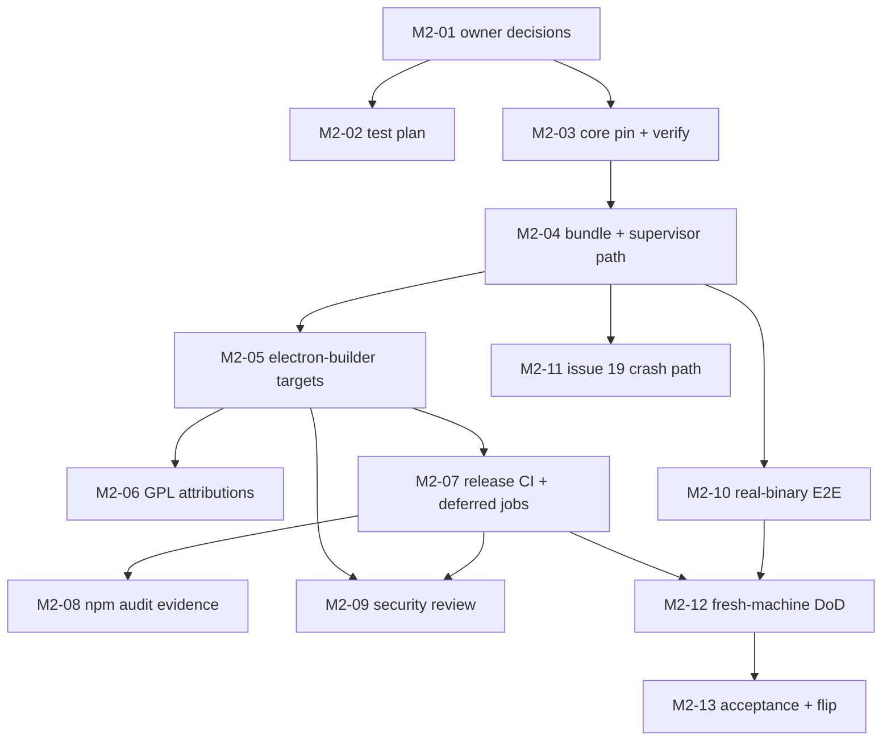

# M2 — Packaging & pinned core: task breakdown

Milestone: **M2** (BRIEF §8) · Owner: DevOps · Status: **in progress**
Parent plan: `docs/plans/milestones.md`

**Legend:** task ID · owner · size (S ≈ 0.5 d, M ≈ 0.5–1.5 d, L ≈ 2+ d) · deps · status
**Status values:** `todo` / `in progress` / `done` / `blocked`
**Estimate range:** 1–2 working weeks (assumptions in `milestones.md` §Estimates).

TDD note: the M1 rule carries over verbatim — QA writes the RED test first, dev writes
GREEN second, RED and GREEN are separate commits, `npm run format` before every commit,
tests only ever grow (additive barriers/setup are allowed; weakening is not). New TC IDs
are declared in `docs/qa/m2-test-plan.md` per batch; config/doc pins follow the raw-text
pattern of DV-36/DV-37.

---

## Owner decisions recorded before any pin (2026-10-08)

- **No Apple Developer account** (too expensive) → macOS ships an **unsigned** `.dmg` +
  Gatekeeper instructions; notarization is out of scope (R-2 closed, BRIEF §10 amended).
- **Linux formats: AppImage + `.deb` + `.rpm`** — `.rpm` added to the original
  AppImage + `.deb` line (BRIEF §9 amended).

---

## Checklist (ordered — do not reorder without re-checking deps)

### Phase A — Bootstrap & specs

- [x] **M2-01** · project-manager · **S** · deps: — · `done`
      Record the owner decisions above in `BRIEF.md` §9/§10 and
      `docs/plans/milestones.md` §M2 (deliverables, DoD #1 wording, R-1/R-2) —
      this commit. Spec-before-pin (house rule).
- [x] **M2-02** · qa · **S** · deps: M2-01 · `done`
      Open `docs/qa/m2-test-plan.md` — scope: packaging config pins, core-pinning
      verification, real-binary integration, attributions, release CI; declare the
      M2 TC families + a deviations log in the M1-test-plan style.
      Evidence: `28cef84` (plan opened, TC-PKG family + DV-38 declared).

### Phase B — Core pinning (risk R-1)

- [x] **M2-03** · devops · **M** · deps: M2-01 · `done`
      Pin the core: resolve tag → commit SHA for the chosen
      `Fedarisha/Xray-core-fedarisha` release (available: `v26.9.9-1.0.1fed`,
      published 2026-09-26), download `Xray-linux-64.zip`, `Xray-macos-64.zip`,
      `Xray-macos-arm64-v8a.zip` + their `.dgst` files, record tag / commit SHA /
      SHA-256 per asset in `docs/analysis/core-pin.md` (BRIEF §9), and add
      `scripts/verify-core-pin.mjs` that passes on a good hash and fails loudly on
      a bad one. RED first (script behavior + pin-doc structure).
      Evidence: RED `8465d3b` (TC-PKG-01..03, observed 3 failed | 215 passed) →
      GREEN in this commit (`docs/analysis/core-pin.md` + verify script +
      `verify:core-pin`; 218 passed | 0 failed; all 3 real assets `core pin OK`,
      tampered file exit 1 MISMATCH; upstream `.dgst` cross-check matched).
- [ ] **M2-04** · developer · **M** · deps: M2-03 · `todo`
      Bundle the pinned binary into the app (`extraResources`, per-platform path)
      and teach the supervisor to resolve it: packaged path > `CORE_BINARY_PATH`
      dev override (kept — the M1 suites depend on it) > honest error when neither
      exists. RED first: unit pins for the resolution order + platform mapping.

### Phase C — Packaging

- [ ] **M2-05** · developer · **L** · deps: M2-04 · `todo`
      `electron-builder` config: `appId` / productName, targets — macOS **unsigned**
      `.dmg`, Linux **AppImage + `.deb` + `.rpm`** (x64 first, arm64 follows in the
      CI matrix per BRIEF §9); core in `extraResources`; asar on. Gatekeeper
      instructions doc for the unsigned build (`docs/product/macos-gatekeeper.md`).
      RED: structural config pins — every target present, no signing identity
      configured, core included, instructions doc exists.
- [ ] **M2-06** · developer · **S** · deps: M2-05 · `todo`
      GPL-3.0 compliance (BRIEF §5): third-party attributions + license texts ship
      inside the artifacts (`resources/licenses/` — Electron, the xray-core Go
      dependency, notable npm deps). RED: pin every listed package has its license
      file and the pack config includes the directory (M2 DoD #4).

### Phase D — Release CI & gates

- [ ] **M2-07** · devops · **M** · deps: M2-05 · `todo`
      Release workflow: push a tag → matrix (macos-latest, ubuntu-latest) builds the
      artifacts and writes a SHA-256 manifest verified at build time (M2 DoD #1).
      Land the two M1 deferrals into regular CI in the same batch: the **coverage
      job** with `thresholds.lines: 80` (G-05) and the **e2e job** per
      `docs/qa/e2e-ci-proposal.md`.
- [ ] **M2-08** · devops · **S** · deps: M2-07 · `todo`
      Live `npm audit` evidence for the packaging chain (issue #2, M0-19 S4-5):
      record the output in `docs/qa/security-m2-audit.md`, triage highs into
      GitHub issues.
- [ ] **M2-09** · cybersecurity · **M** · deps: M2-05, M2-07 · `todo`
      Security review before external distribution (M2 DoD #3): supply chain
      (pin ↔ hash ↔ artifact), S3 key handling in the packaged app, IPC surface
      re-check. Findings → GitHub issues (house rule), not comments.

### Phase E — Real-binary verification & acceptance

- [ ] **M2-10** · qa · **L** · deps: M2-04 · `todo`
      Real-binary integration (strategy D-4: fake-core → pinned binary): supervisor
      spawn / ready / exit behavior against the bundled core. Needs a free
      `127.0.0.1:10808`, so the suite runs in CI or a VPN-off window (the Q9
      pattern); capture the **authoritative coverage number** in the same window
      (G-05).
- [ ] **M2-11** · developer · **M** · deps: M2-04 · `todo`
      Issue #19 (filed from M1-27b D-10): crash-path surfacing — quit-time
      `E-PLAT-003` persistence (FR-35), the `errors.md` §6 crash branch, and the
      tray freshness advisory. RED first against its own acceptance checklist.
- [ ] **M2-12** · project-manager · **M** · deps: M2-07, M2-10 · `todo`
      Fresh-machine install run (M2 DoD #2): install the packaged app → import →
      start → stop; this is also where the **Q9-waived M1 desktop manual rows**
      land (acceptance §8). Checklist: `docs/qa/m2-fresh-machine.md`.
- [ ] **M2-13** · project-manager · **S** · deps: M2-12 · `todo`
      M2 acceptance report → flip M2 in `milestones.md` → handoff → M3; triage the
      leftovers (issue #5 S4-3 closes here or moves to M3 with an explicit note).

---

## Dependency graph

## Open items tracked outside the board

- Issue #2 — npm audit evidence → executed by M2-08.
- Issue #19 — crash-path surfacing → executed by M2-11.
- Issue #5 — S4-3 broadcast guard → triaged at M2-13.
- `docs/qa/e2e-ci-proposal.md` + coverage job (G-05) → landed by M2-07.
- Q9-waived M1 desktop manual rows + authoritative coverage number → M2-10/M2-12.
