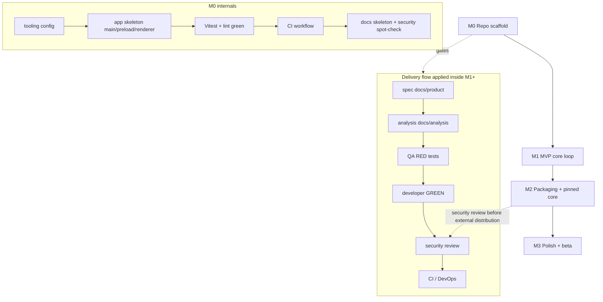

# Milestones — s3-bypass-desktop

Source of truth: `BRIEF.md` §8. Owner: Project Manager. All artifacts in English.

**Estimates below are ranges (see §Estimates), not commitments.**

---

## Current status (as of this writing)

| Milestone                        | Status                                                                                                                                                                           |
| -------------------------------- | -------------------------------------------------------------------------------------------------------------------------------------------------------------------------------- |
| **M0 — Repo scaffold**           | **IN PROGRESS** — planning docs exist (`docs/plans/`); no scaffold files committed yet (repo currently contains only `BRIEF.md` and `README.md`). All M0 build tasks are `todo`. |
| **M1 — MVP core loop**           | NOT STARTED — blocked on M0.                                                                                                                                                     |
| **M2 — Packaging & pinned core** | NOT STARTED — blocked on M1.                                                                                                                                                     |
| **M3 — Polish + beta**           | NOT STARTED — blocked on M2.                                                                                                                                                     |

Honesty note: "in progress" for M0 means _planning done, execution not yet started_. The board in `docs/plans/m0-scaffold.md` is the authoritative checklist; a milestone flips to `done` only when its Definition of Done below is fully met — stale `done` is a bug.

---

## M0 — Repo scaffold

**Brief:** Electron + Vite + React, lint/format/test, CI.

### Concrete deliverables

- `package.json` + `tsconfig.json` with TypeScript **strict** (plus `noUncheckedIndexedAccess`, `exactOptionalPropertyTypes`).
- Electron app skeleton with the three-process split: `src/main/`, `src/preload/`, `src/renderer/`, shared types in `src/shared/`.
- Secure-by-default BrowserWindow: `contextIsolation: true`, `sandbox: true`, `nodeIntegration: false`; minimal `contextBridge` placeholder in `src/preload/`.
- Vite dev/build wiring (`npm run dev` = Electron + Vite with HMR).
- Tooling: ESLint (flat config, typescript-eslint), Prettier, Vitest (+ React Testing Library for renderer), `npm run lint | format | typecheck | test`.
- CI workflow (`.github/workflows/ci.yml`): lint + typecheck + test on every push, matrix **macos-latest + ubuntu-latest**.
- Folder structure per `BRIEF.md` §4 and docs skeleton: `docs/product/`, `docs/analysis/`, `docs/qa/`, `docs/plans/` with starter templates.
- `.gitignore` (incl. `.env`) and `.env.example` only — no real secrets ever (BRIEF §7).
- License/GPL notice file covering the bundled Go core (BRIEF §5).

### Definition of Done

1. `npm install && npm run lint && npm run typecheck && npm test` pass on a clean clone on **both** macOS and Linux.
2. `npm run dev` opens a window with the React renderer talking to `main` through the preload bridge.
3. CI workflow green on `main` for both OS matrix legs.
4. Docs skeleton exists and is linked from `README.md`.
5. Security spot-check of scaffold defaults (IPC surface, window flags) passed by `cybersecurity`.
6. **Handoff:** `project-manager` announces M0 done → `qa` may start M1 RED tests.

### Estimate

4–7 working days (assumes: single dev agent per role, npm registry reachable, no native-module surprises with Electron; CI minutes available).

---

## M1 — MVP core loop

**Brief (BRIEF §2):** import → start → status → proxy → tray → logs, plus secret storage.

### Concrete deliverables

1. **Profile import** — file picker for client-config JSON; validation with human-readable errors (no stack traces).
2. **Start / Stop** — supervisor spawns/kills the core binary (dev-provided during M1; pinning is M2); local SOCKS inbound on `127.0.0.1:10808`.
3. **Status** — `running / stopped / core-crashed` state machine with last error readable in UI.
4. **System-proxy toggle** — macOS via `networksetup`, Linux via GNOME `gsettings`; honest "do it manually" hint elsewhere.
5. **Tray** — starts hidden to tray; closing the window keeps the app running.
6. **Logs view** — bounded in-memory buffer; never secrets or full configs (redaction enforced).
7. **Secret storage** — config + S3 keys encrypted at rest via Electron `safeStorage`; never sent to renderer, never plaintext on disk.
8. Upstream artifacts: user stories (`docs/product/`), requirements/IPC contract (`docs/analysis/`), test strategy (`docs/qa/`).

### Definition of Done

1. All BRIEF §2 items demonstrated end-to-end on macOS **and** Linux (manual acceptance script by `product-manager`).
2. Every task passed strict TDD: QA RED test exists first, then dev GREEN; no test weakened to pass.
3. Security review (`cybersecurity`) of secret handling, IPC surface, and log redaction: no high/critical findings open.
4. CI green on `main`; unit + smoke E2E (import → start → status → stop) pass.
5. **Handoff:** `project-manager` announces M1 done → `devops` starts M2 packaging.

### Estimate

3–5 weeks (assumes: M0 done, specs written first, one dev + one QA agent, no waiting on user-supplied S3 credentials for tests — tests use fixtures).

---

## M2 — Packaging & pinned core

**Brief:** dmg / AppImage / deb, pinned core binary, release CI.

### Concrete deliverables

- Core binary **version- and SHA-256-pinned**, cross-built for `darwin-x64`, `darwin-arm64`, `linux-x64`; pin (release + commit SHA) recorded in docs (BRIEF §9).
- `electron-builder` config → `.dmg` (macOS), AppImage + `.deb` (Linux).
- Release CI: build artifacts **on tags**; lint/test still on every push.
- GPL-3.0 compliance for the bundled Go core (license texts shipped/attributed).
- macOS: unsigned build + Gatekeeper instructions (notarization is backlog, owner call).

### Definition of Done

1. Tag produces installable artifacts for all three targets; SHA-256 of bundled core verified at build time.
2. Fresh-machine install runs the MVP loop (import → start → stop) from the packaged app.
3. Security review before any external distribution (BRIEF §5): supply chain, S3 key handling, IPC — findings triaged.
4. GPL notice + third-party attributions present in artifacts.
5. **Handoff:** M2 done → M3 beta cohort gets download links.

### Estimate

1–2 weeks (assumes: no Apple Developer account yet — see blockers; CI cross-build capacity available).

---

## M3 — Polish + beta

**Brief:** usability, error wording, docs.

### Concrete deliverables

- Error-message pass (human wording everywhere; BRIEF §2.1 rule applies globally).
- Usability pass on the core loop; empty/loading/error states; app icon + naming ("S3 Bypass Desktop").
- User documentation: install, first profile, troubleshooting, manual system-proxy hints.
- Beta distribution to a small cohort; feedback triage into backlog (BRIEF §3 stays out of scope).
- i18n groundwork (English first; Russian later — backlog).

### Definition of Done

1. Beta installers handed to at least one external tester with written setup doc.
2. No open `critical`/`high` issues from beta feedback or security review.
3. Docs complete and consistent with shipped behavior.
4. Backlog (BRIEF §3) recorded in `docs/product/` for post-MVP prioritization.

### Estimate

1–2 weeks + beta soak time (assumes: beta testers available; scope creep from backlog kept out).

---

## Dependency graph

Cross-milestone hard dependencies:

- M1 cannot start until M0 DoD #1–#3 pass (toolchain + CI must exist for TDD).
- M2 needs M1 supervisor (packaging must ship a runnable supervisor) and M1 security review.
- M3 needs installable M2 artifacts.
- `cybersecurity` review gates external distribution (M2 exit), not code merges.

---

## Estimates — assumptions (apply to every number above)

- Ranges assume the team works the flow sequentially per feature: spec → analysis → QA RED → dev GREEN → review → CI.
- One agent per role; no parallel staffing bonus baked in.
- Excluded from ranges: user-side decisions (Apple account, S3 provider presets — BRIEF §10), upstream `Fedarisha/Xray-core-fedarisha` release availability, CI queue time.
- These are informed guesses from a similar-stack reference, **not** measured velocity — revisit after M0 with actuals.

## Risks & blockers (watch list)

| ID  | Item                                                         | Impact                                                   | Owner                              | State                   |
| --- | ------------------------------------------------------------ | -------------------------------------------------------- | ---------------------------------- | ----------------------- |
| R-1 | No core binary available to M1 supervisor until pinning (M2) | Start/Stop tests need a stub or dev-provided binary      | project-manager / devops           | open — plan: stub in M1 |
| R-2 | Apple Developer account (notarization) undecided             | M2 macOS distribution limited to unsigned + instructions | owner (user)                       | open, owner call        |
| R-3 | `docs/product/` and `docs/analysis/` do not exist yet        | M1 QA cannot derive tests without specs                  | product-manager / business-analyst | open — first M1 tasks   |
| R-4 | Repo has no code yet; CI config unverified                   | M0 estimates may shift once toolchain chosen             | project-manager                    | open — monitor          |
